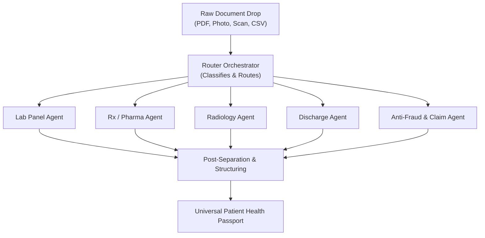

# CDSI — Clinical Decision Support Intelligence

> **The Universal Health Passport & Multi-Agent Clinical Operating System.**  
> An AI-powered health platform that transforms raw medical documents, lab panels, radiology scans, and prescriptions into structured, actionable clinical insights—accessible via Web, Mobile, and 1/1 NFC Smart Cards.

[](http://www.cdsi.in/)
[](http://www.cdsi.in/)
[]()

---

## 🌟 Overview

**CDSI (Clinical Decision Support Intelligence)** is a full-stack healthcare AI platform designed to solve the critical problem of medical record fragmentation and communication latency during care. 

Built in a **72-hour development sprint**, CDSI introduces a **zero-friction "Dump & Auto-Separate" multi-agent upload pipeline**. Patients, laboratories, doctors, and hospitals can upload any document format (scanned PDFs, physical paper photos, DICOM summaries, handwritten notes), and a team of specialized autonomous agents automatically classifies, extracts, and indexes the data into a unified **Universal Health Passport**.

The platform provides **Dual-View Outputs**:
1. **Patient View:** Plain-English summaries, visual risk gauges, and out-of-range lab anomaly flags to eliminate medical jargon and anxiety.
2. **Clinician View:** High-density clinical tables, ICD-10 coding prompts, differential diagnosis suggestions, and drug-interaction warnings.

---

## 🔄 Multi-Agent Ingestion Pipeline ("Dump & Auto-Separate")

Instead of forcing users to manually select document types or fill out clunky drop-down menus, CDSI routes all uploaded content through an autonomous **Multi-Agent Architecture**:



### Specialized Subagent Breakdown:
* 🧪 **Lab Panel Agent:** Extracts numerical lab metrics (HbA1c, Lipid Panels, CBC, TSH), reference ranges, and flags critical anomalies in red.
* 💊 **Rx & Pharma Agent:** Extracts prescribed medications, dosages, refill frequencies, and performs real-time **Drug-Drug Interaction** checks against existing active meds.
* 🩻 **Radiology Agent:** Extracts clinical conclusions from MRI, CT, and X-ray report narratives (e.g., *"L4-L5 disc bulge"*).
* 📋 **Discharge & Operative Agent:** Structures surgical notes, ICD-10 diagnosis codes, post-op instructions, and follow-up timelines.
* 🛡️ **Anti-Fraud & Verification Agent:** Validates digital signatures from accredited labs/hospitals to eliminate tampered records and duplicate billing.

---

## 🚀 4-Phase Product Progression Roadmap

CDSI is evolving from an immediate software wedge into a global healthcare hardware-software network:

### Phase 1: Web & Mobile AI Parsing Engine *(LIVE V0 POC — Current Stage)*
* Live web portal at [`www.cdsi.in`](http://www.cdsi.in/) (Demo Access Key: `xxxxxxxxxxxxxxxx`).
* Mobile-responsive interface walkthrough (`Latest V0 Mobile Interface.MP4`).
* V2 Multi-Page Report Export engine generating structured PDF downloads.
* 20-Language international UI translation system.

### Phase 2: Domain-Trained BioMedical AI Model *(In Progress)*
* Replacing generic foundation models with a fine-tuned biomedical LLM trained on PubMed, ClinicalTrials.gov, WHO, and FDA drug interaction registries.
* **Grounding via RAG (Retrieval-Augmented Generation)** over verified medical literature for 100% factual, zero-hallucination outputs.

### Phase 3: 1/1 NFC Smart Health Passport Cards *(Next Milestone)*
* **"Tap-and-Go" Emergency Triage:** Encrypted physical NFC cards for patients, doctors, labs, and hospitals with unique 1/1 identifiers.
* **Dual-Layer Access:** 
  * *On-Chip (Offline):* Critical emergency data (Blood Group, Severe Allergies, Chronic Conditions, Emergency Contacts) readable by EMTs without internet access.
  * *Cloud-Synced (Online):* Authenticated smartphone tap loads the patient's complete historical medical ledger.

### Phase 4: Global Anti-Fraud & Verified Medical Registry
* Immutable lab result signing directly into the patient's 1/1 profile by accredited diagnostic centers.
* Complete elimination of record fragmentation, lost physical binders, and redundant $500+ diagnostic re-testing across hospital networks.

---

## ✨ Core Features & Visual Dashboards

### 1. Interactive Clinical Dashboard
* **Risk Assessment Gauge:** Radial and severity-based visualization of patient risk status.
* **Lab Anomaly Distribution:** Donut charts grouping Normal vs. Abnormal vs. Critical lab flags.
* **Organ System Status Grid:** Visual status breakdown across major organ systems (Cardiovascular, Metabolic, Renal, Respiratory, etc.).
* **Psychiatric Screening Integration:** Built-in scoring and tracking for **PHQ-9** and **GAD-7** instruments.

### 2. Multi-Page Professional PDF Export (V2 Format)
* Full multi-page A4 report generation server-side using PDFKit.
* Color-coded Risk Assessment cover banner.
* Summary statistics row (Total Labs, Abnormal Count, Critical Flags, Confirmed Findings).
* Organ system grid cards and complete lab tables with reference sub-labels.
* Regulatory disclaimer block and automated page numbering.

### 3. 20-Language Internationalization
Full UI and report translation support across:
> English · Arabic · French · Spanish · German · Portuguese · Hindi · Urdu · Chinese (Simplified) · Japanese · Korean · Russian · Turkish · Italian · Dutch · Polish · Bengali · Swahili · Persian · Malay

---

## 🛠️ Tech Stack

| Layer | Technology |
|---|---|
| **Frontend** | React 18, Vite, Tailwind CSS, Wouter Router |
| **Data & State** | TanStack Query v5, React Context (CDSIContext) |
| **Data Visualization** | Recharts 2.x |
| **Backend** | Node.js, Express, esbuild |
| **Multi-Agent Pipeline** | Custom Orchestrator + Specialized Extraction/Reasoning Subagents |
| **AI Processing** | OpenAI-compatible Multimodal Vision & Reasoning APIs |
| **PDF Generation** | PDFKit (Server-Side) |
| **PDF Parsing** | pdf-parse v2 |
| **Monorepo Management** | pnpm Workspaces |

---

## 📂 Project Structure

```text
CDSI-AI/
├── artifacts/
│   ├── cdsi-platform/                        # React 18 + Vite Frontend App
│   │   └── src/
│   │       ├── pages/
│   │       │   ├── Upload.tsx                # Multi-agent document upload dropzone
│   │       │   ├── Intake.tsx                # Structured patient demographics & history
│   │       │   ├── Processing.tsx            # Real-time multi-agent processing progress
│   │       │   ├── Report.tsx                # Dual-view interactive report + charts
│   │       │   └── Settings.tsx              # 20-Language & portal settings
│   │       ├── context/
│   │       │   └── CDSIContext.tsx           # Global state (Language, Session, Report)
│   │       └── translations.ts              # 20-Language translation engine
│   └── api-server/                          # Express Backend Server
│       └── src/
│           ├── routes/
│           │   ├── analysis.ts               # POST /api/analyse - Multi-agent pipeline trigger
│           │   ├── export.ts                 # POST /api/export-report - PDF export generator
│           │   └── status.ts                 # GET /api/status/:jobId - Async status polling
│           ├── services/
│           │   ├── pdfExport.ts              # Multi-page PDF report builder
│           │   ├── extractionService.ts      # Multi-agent entity extraction
│           │   └── clinicalReasoningService.ts # AI risk & reasoning pipeline
│           └── types/
│               └── report.ts                 # Shared ClinicalReport schema
└── package.json
```

---

## 🔒 Security & Medical Disclaimer

> **CDSI is a Clinical Decision Support tool intended solely to assist licensed healthcare professionals and empower patients.** It does not constitute a formal medical diagnosis or treatment plan. All AI-generated findings must be independently reviewed and verified by a qualified clinician before any clinical action is taken.

---

*Built with high velocity for the future of global digital health.*
